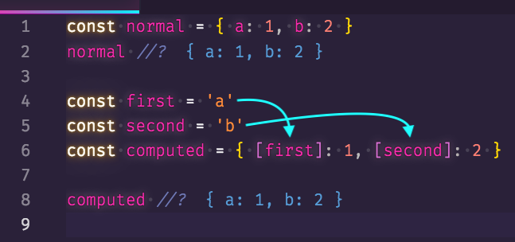
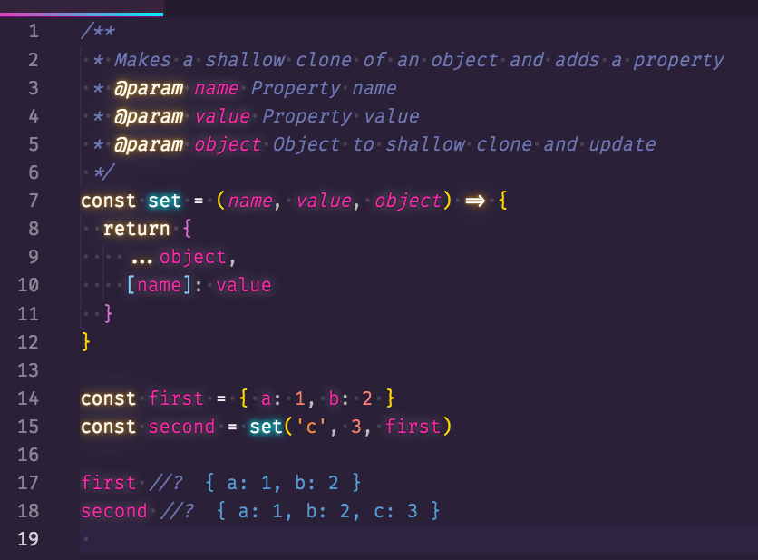
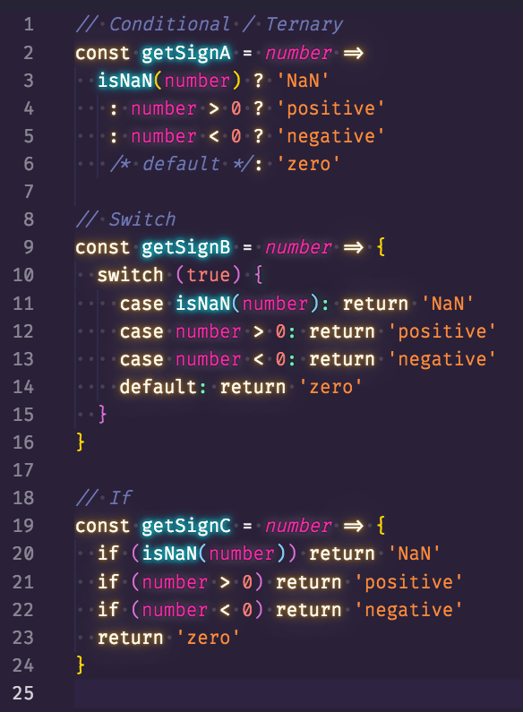
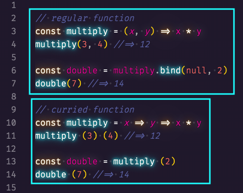
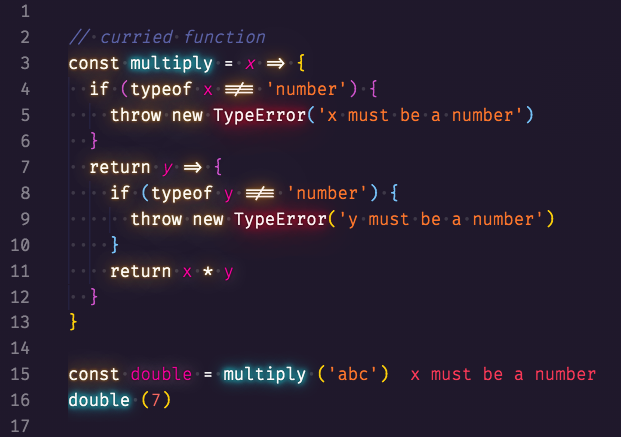
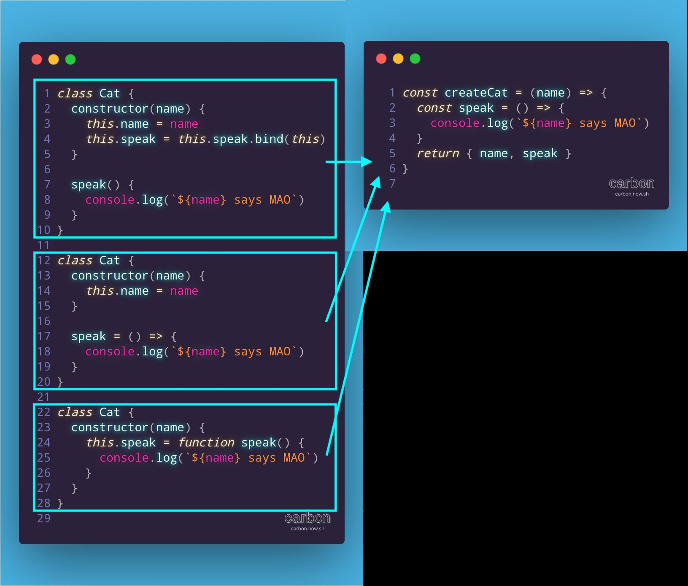

# Developer [JavaScript Joel](https://twitter.com/joelnet)

### Tip # 1

`Computed Properties` are handy when you don't know the name of the property or the key contains special characters. A demo of this feature is `set` where the name is not known.

### Tip # 2

🤔 Not sure why there's so much fear around the `ternary operator`. They don't appear to be much different than a switch or if. There are more similarities than differences

### Tip # 3 Curring in JS

When you need to partially apply arguments to a function (partial application), consider currying the function. As a bonus, code can run after each argument is applied

For more information read the article [Understanding Currying in JavaScript](https://blog.bitsrc.io/understanding-currying-in-javascript-ceb2188c339)

### Tip # 4

The 3 blocks of code on the left do the same thing. That is, they create a new instance of a function for every object created.

- They do not reuse the prototype function
- They become the same as the function on the right
- These patterns are common in React

[:arrow_up: Back to top](#developer-javascript-joel)
