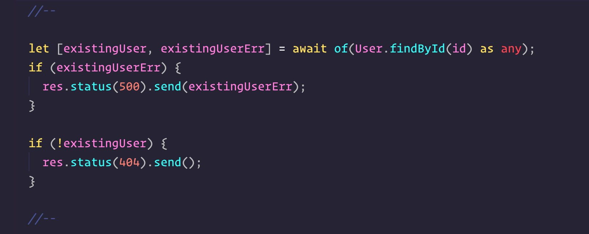

# Developer [Wassim CHEGHAM aka WASM](https://twitter.com/manekinekko)

### Tip # 1 `async of`

Do you hate using try-catch blocks with your async-await code? 
Then, await-of is the right library for you:

```js

const [existingUser, existingUserErr] = await of(User.findById(id));
if (existingUserErr) {
  res.status(500).send(existingUserErr);
}

```

[Library Link - Github](https://github.com/xobotyi/await-of)



### Tip # 2 Toggle Multi-line Comments

The `//*/ //*/` multi-lines #code comment toggle

[Watch Demo Twitter](https://twitter.com/i/status/1196951738927996930)

[:arrow_up: Back to top](#developer-wassim-chegham-aka-wasm)