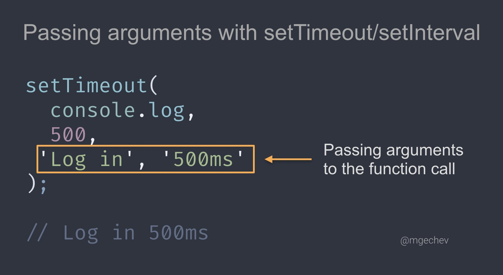
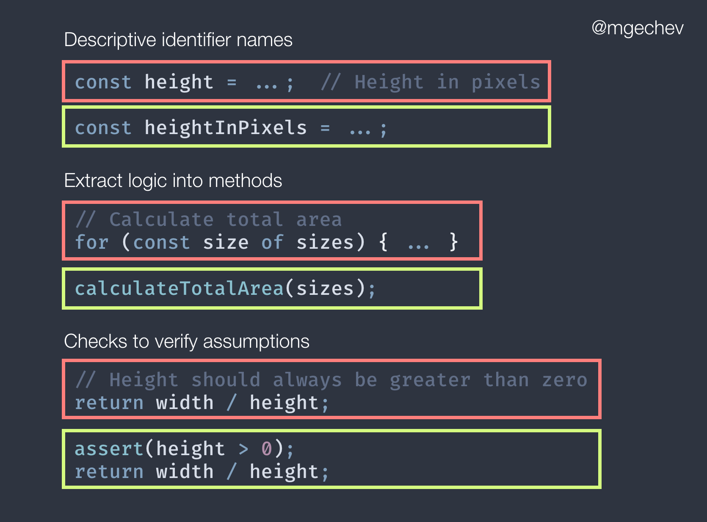

# Developer [Carlos Caballero](https://twitter.com/mgechev)

### Tip # 1

✨ You can set the parameters of the function passed to setInterval, setTimeout, and setImmediate by specifying extra arguments in the call.

### Tip # 2

Comments are essential for making your code easy to understand but taking this to the extreme brings a lot of noise and increases maintenance

Often you can reduce the need for comments with:

- Descriptive identifier names
- Extract logic to methods
- Checks to verify assumptions

