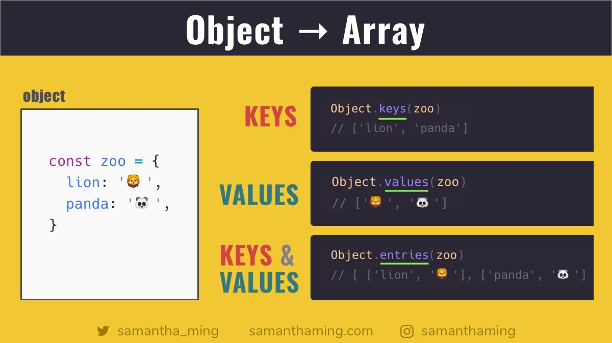

# Developer [Samantha Ming](https://twitter.com/samantha_ming)

### Tip # 1

Converting Object → Array, Finally with ES2017, we officially have 3 variations to convert an Object to an Array 🎊
Array has an array of methods (sorry, bad pun 😝). So by converting the object into an array, you have access to all of that. Yay 🥳

