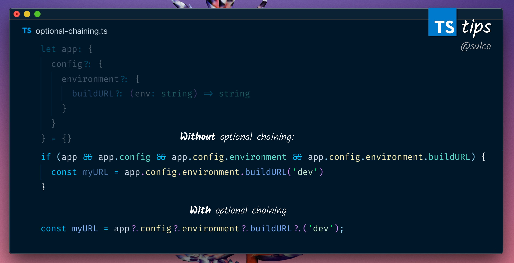

# Developer [Tomek Sułkowski](https://twitter.com/sulco)

### Tip # 1

When you return an array, **TypeScript** infers the type as an `Array` of included types (see attached code)
If you want this value to be inferred as a Tuple instead, add `as const` to the return statement

### Tip # 2

The latest TypeScript ver 3.7 introduced optional chaining. Which is the best thing since TypeScript.

[:arrow_up: Back to top](#developer-tomek-sułkowski)