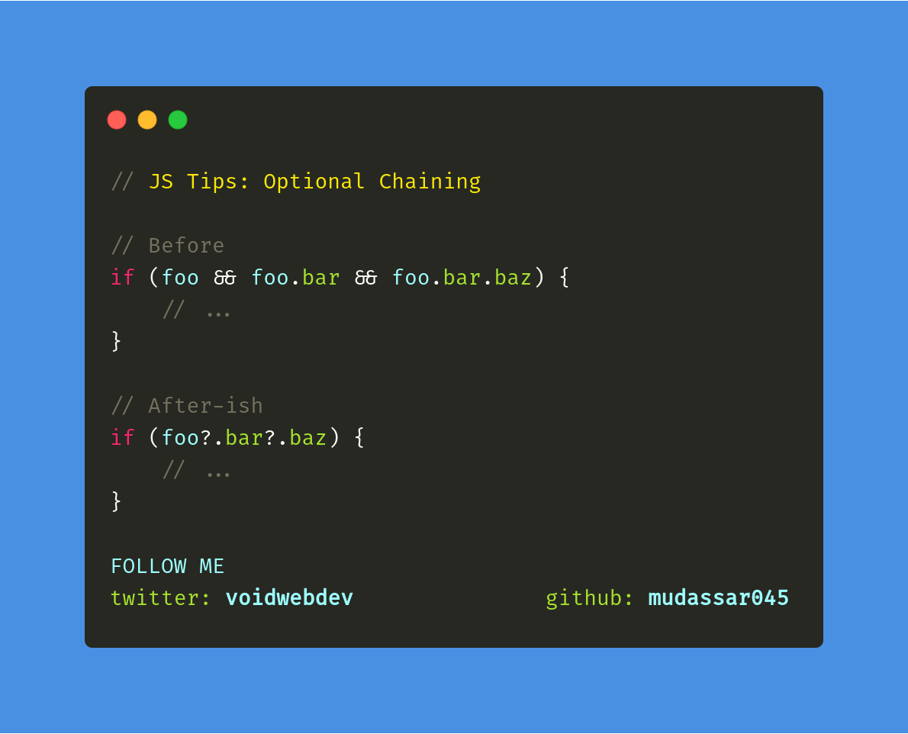

# Developer [Mudassar Ali](https://twitter.com/voidwebdev)

### Tip # 1 - Optional Chanining

Option chaining has arrived in TypeScript

Read more: [TypeScript 3.7](https://devblogs.microsoft.com/typescript/announcing-typescript-3-7/)

[:arrow_up: Back to top](#developer-mudassar-ali)