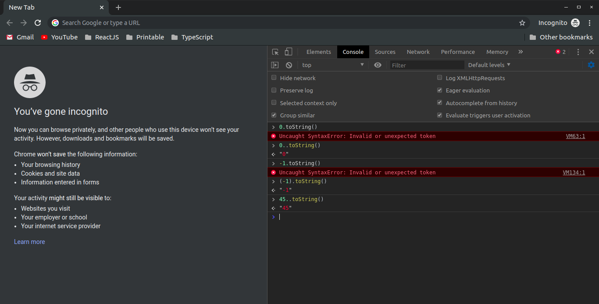
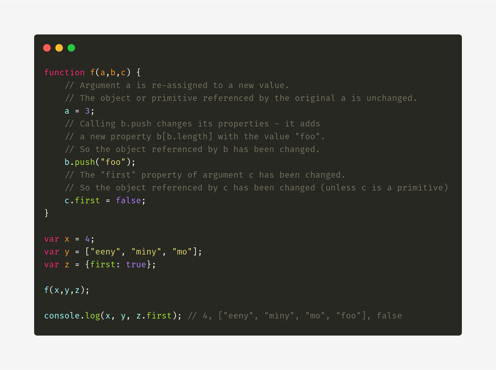
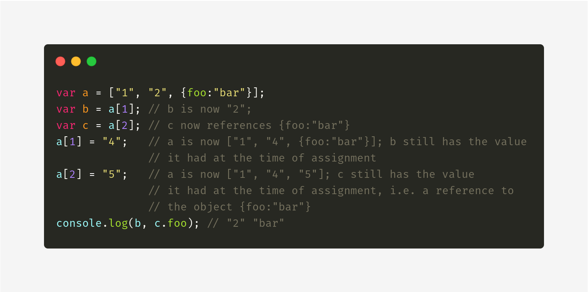

# Developer [Mudassar Ali](https://twitter.com/voidwebdev)

### Tip # 1 - Optional Chanining

Option chaining has arrived in TypeScript

Read more: [TypeScript 3.7](https://devblogs.microsoft.com/typescript/announcing-typescript-3-7/)

### Tip # 2 - Convert `Number` to `String` using `..` and `()`

### Tip # 3 - ES - JS by Reference vs Value

- Javascript is always pass by `value`, but when a variable refers to an object (including arrays), the `"value"` is a `reference` to the `object`.
- Changing the value of a variable never changes the underlying `primitive` or `object`, it just points the variable to a new primitive or object.
- However, changing a `property` of an `object` referenced by a variable does change the underlying object.

Follow the link to learn more about the problem, [Passing value by Reference vs Value](https://stackoverflow.com/questions/6605640/javascript-by-reference-vs-by-value)

Check the following examples below:

Example - 2

[:arrow_up: Back to top](#developer-mudassar-ali)