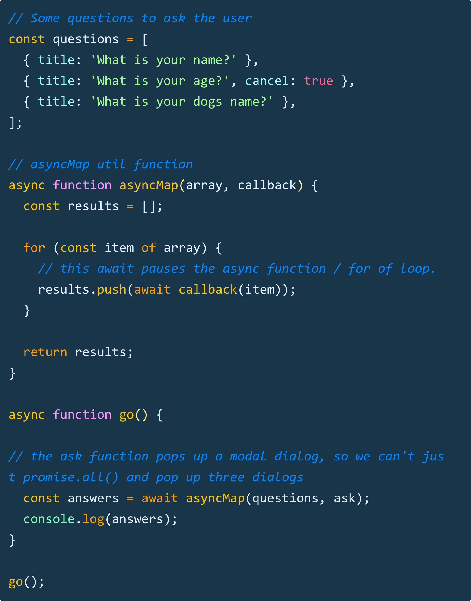

# Developer [Wes Bos](https://twitter.com/wesbos)

### Tip # 1

🔥 If you need to remove multiple `classes` from multiple elements, you can loop over them and `...spread` into the remove method. This sends each item of the array as an argument to the method.

### Tip # 2

🔥`for of` loops can be paused with an await, unlike .forEach() or .map(). Here is a simple asyncMap() function we code in my upcoming Beginner JS course when we need to pop up dialogs in series

[:arrow_up: Back to top](#developer-wes-bos)