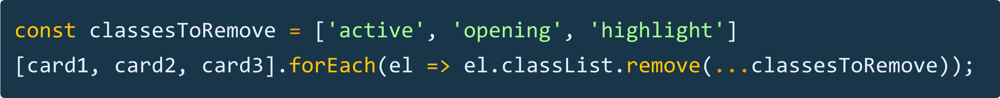

# Developer [Wes Bos](https://twitter.com/wesbos)

### Tip # 1

🔥 If you need to remove multiple `classes` from multiple elements, you can loop over them and `...spread` into the remove method. This sends each item of the array as an argument to the method.

[:arrow_up: Back to top](#developer-wes-bos)